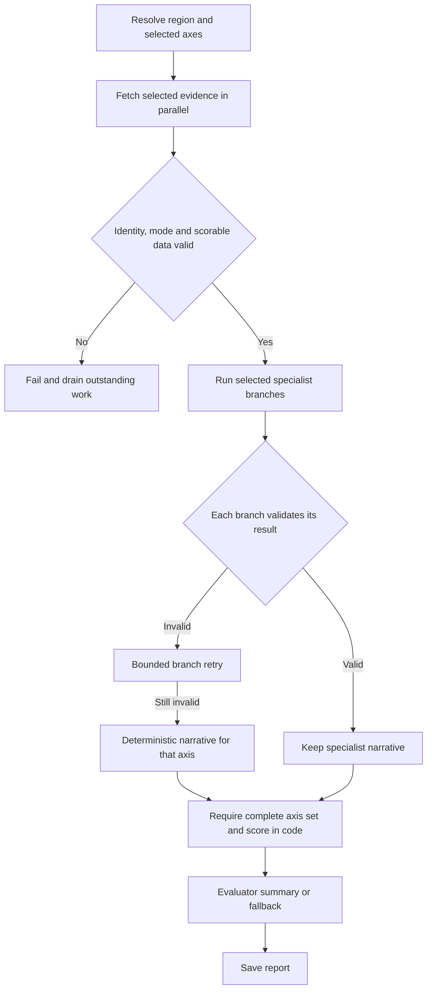

# Assessment workflow

Data selection and scoring have a fixed host contract; models explain validated
evidence. A free-running planner loop is unnecessary for this task.

Each specialist model receives only its own axis evidence. Every attempt uses a
fresh session. The host validates the returned axis; only a failed branch retries
up to `SPECIALIST_ATTEMPTS` (default 2) and then falls back. Graph contract errors
fail visibly instead of replacing all successful specialist results.

`DATA_TIMEOUT_SECONDS` bounds region resolution and each fetch.
`AGENT_TIMEOUT_SECONDS` bounds specialist/evaluator calls. Cancellation propagates;
outstanding fetches are cancelled and joined before returning.

Missing required data does not produce partial scores or substitute mock values.
Explicit exclusions remove axes before fetching and deliberately redistribute
weights. Overall scoring requires exactly one result per enabled axis. Context-only
metrics do not affect scores; zero-quality evidence lowers confidence.

HTTP/SSE/report schemas and user axis selections remain compatible. The existing
execution log identifies specialist fallback.

`GovernmentApiRegionalDataProvider.fetch_axis` still has an unimplemented live
indicator/GIS mapping. This change bounds and reports that failure; it does not
turn demo metrics into real regional data. Tests use the mock provider and scripted
specialists; live API behavior is not validated.
