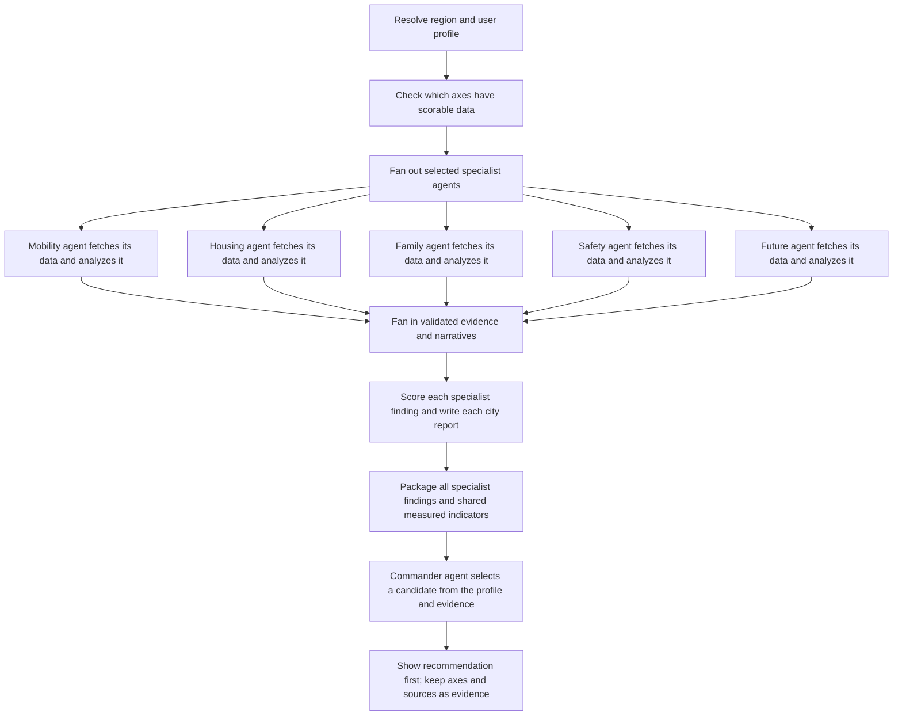

# Assessment and comparison workflow

Each specialist branch fetches its assigned evidence through the regional data provider and then analyzes only that axis. `WorkflowBuilder` runs the selected branches in parallel and validates that each branch returns its own evidence and narrative. Missing required data fails that branch; it is never replaced with mock values during a live assessment. Quality-zero indicators do not affect scores.

The planning step checks whether a region has any scorable evidence for an axis. An unavailable axis is excluded and its overall weight is redistributed. Inside a selected specialist, missing indicators remain visible and lower confidence. Profile-specific rules such as a single household excluding childcare indicators run before the family specialist analyzes its evidence.

Each city's report stores its specialist findings and per-axis evidence. It has no combined livability score and no extra per-city evaluator agent. When the user compares cities, `/v1/agent/comparisons` sends the full user conditions, priority weights, each candidate's specialist findings, metric values and availability states to `LivabilityCommanderAgent`. The commander selects a candidate code or returns no recommendation, then explains the fit, tradeoffs, and concrete next checks. It receives no preselected city or candidate total. If the LLM is unavailable or returns invalid output, the fallback explicitly declines to recommend from axis scores alone. If there are no shared measured axes, the service returns no recommendation.

The frontend shows the household profile's priority shares as context for the commander, and debounces a fresh qualitative synthesis when the user changes a share. Profile edits clear a previous manual-weight override so the displayed percentages respond to the changed household, age bracket, commute, and written preferences.

`DATA_TIMEOUT_SECONDS` bounds each provider call. `AGENT_TIMEOUT_SECONDS` bounds specialist and commander calls. Cancellation propagates through the workflow. The result screen opens with the qualitative proposal, tradeoffs, and next checks. Axis scores, source dates, missing reasons, and execution logs are collapsed under the evidence details.

## Current data boundary

`DATA_MODE=open_data` reads the local verified snapshot during each specialist's fetch. The snapshot is updated separately by `livability-open-data-sync`; the assessment request itself does not make external network calls. `GovernmentApiRegionalDataProvider` still has unimplemented live indicator/GIS mappings, so that mode fails visibly rather than inventing data.

The checked-in catalog defines 23 metrics: 22 scoreable indicators and one tertiary-education context metric. The 2026-09-27 local snapshot contains 10 rows each for Takasaki and Maebashi. Nine scoreable indicators are usable in both cities: convenience 2/5, housing 2/4, family 3/4, safety 0/5, and future 2/4. The campus count is context-only and marked unverified, so it is excluded from scoring. Safety is unavailable for both cities and cannot support a safety recommendation. See [data-sources.md](data-sources.md) for source and field details.

Tests use the mock provider and scripted specialists for workflow validation. The Takasaki/Maebashi coverage check reads the real local snapshot and does not make network calls.
